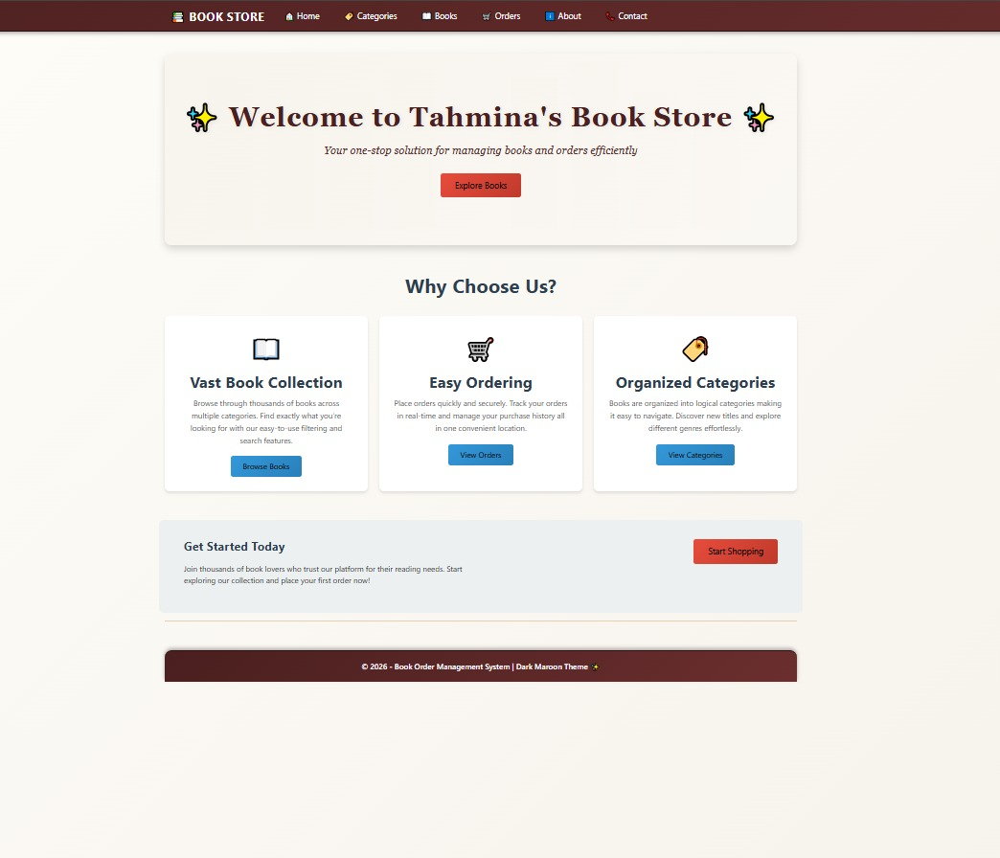
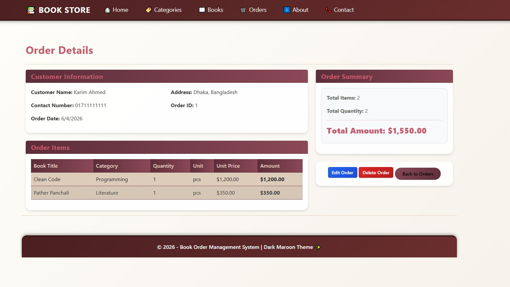
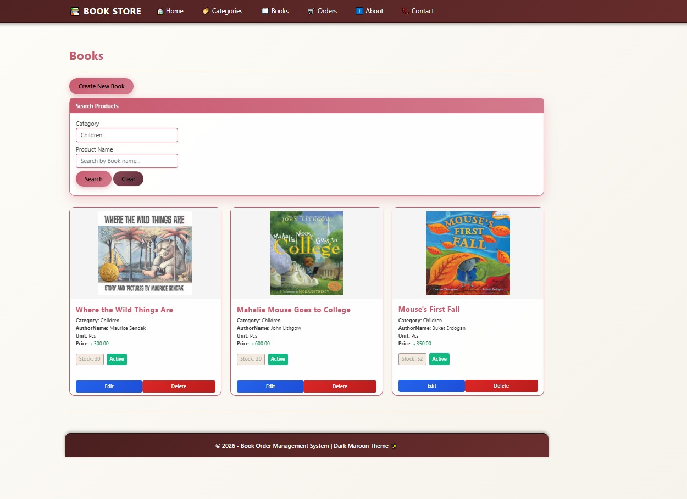
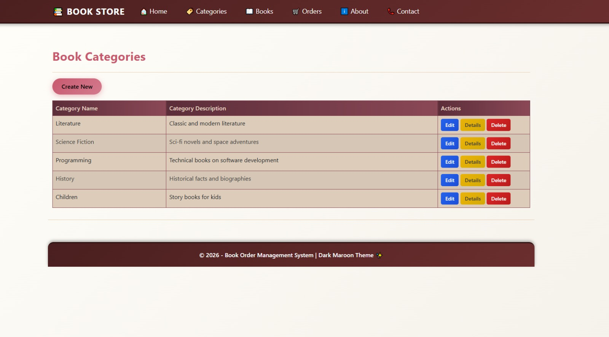
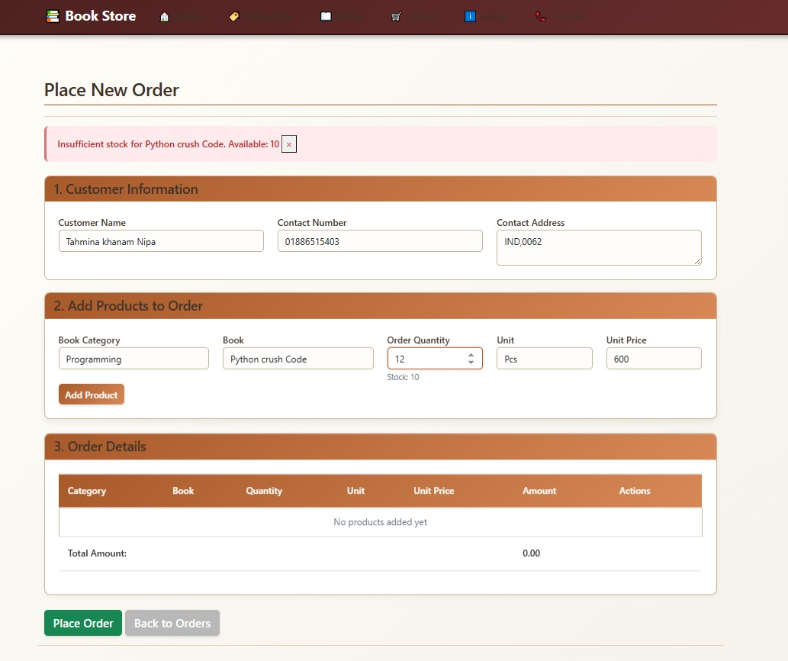

# 📚 Book Store Order Management System

[](https://dotnet.microsoft.com/)
[](#)
[](https://learn.microsoft.com/en-us/ef/)
[](#)

An enterprise-grade, fully normalized **Book Store Order Management System** developed using the **ASP.NET MVC 5** framework and **Entity Framework 6 (Database First Approach)**. The application handles multi-item transactions through a sophisticated Master-Detail design pattern, integrating robust stock management logic and secure relational constraints.

---

## 📌 Business Logic & Core Workflows

* **ACID-Compliant Master-Detail Transactions:** Utilizes `TransactionScope` to execute simultaneous operations. If a customer entry or an item's stock adjustment fails, the entire business transaction rolls back automatically to prevent database corruption.
* **Automated Inventory & Stock Tracking:** Integrated server-side validation checks every item's `AvailableQuantity`. Upon a successful purchase checkout, the dynamic stock engine decrements the inventory balance in real-time.
* **Advanced Client-Side Serialization:** Processes complex multi-item shopping baskets seamlessly from the Razor front-end by serializing object collections into JSON via `Newtonsoft.Json` before posting to the controller.
* **Themed UI/UX Experience:** Designed using a custom localized brown-gold color palette with responsive Bootstrap grid integration, modern cards, and precise financial data alignment.

---

## 📊 Technical Architecture & Stack

### Frontend Layer
- **View Engine:** Razor (C# HTML)
- **Styling:** Bootstrap 3/4 & Tailored CSS Components
- **Client Scripts:** jQuery, AJAX, Modernizer

### Backend & Data Layers
- **Framework:** ASP.NET MVC 5 (.NET Framework 4.8)
- **Data Access:** Entity Framework 6 (EDMX Model Design)
- **Database Engine:** Microsoft SQL Server (RDBMS with Stored Procedures & Triggers)
- **JSON Handler:** Newtonsoft.Json

---

## 📸 Application Showcases

### 1. Main Terminal & Transaction Workspace
The operations cockpit designed for billing agents to configure complex multi-book transactions, manage lists dynamically, and issue invoices.



### 2. Order Specifications & Complete Breakdown
A highly tailored, brand-specific view detailing customer metadata, order status summary, and a tabular presentation of purchased literature with formatted currency calculations.



### 3. Catalog & Inventory Master Setup (Books & Categories)
Administrative interfaces built for managing the core bookstore catalog, creating new book items, and classifying literary genres dynamically to maintain relational database integrity.




### 4. Concurrency & Stock Validation Safety
Demonstration of core validation middleware rejecting transactions when requested unit counts exceed the live warehouse stock levels, providing bulletproof data safety.



---

## ⚙️ Local Deployment Guide

### Prerequisites
- Visual Studio (2019 / 2022 / 2026 Insider Build)
- Microsoft SQL Server & SSMS

### 1. Database Initialization
1. Launch **SQL Server Management Studio (SSMS)**.
2. Execute the provided database script or attach the primary `.mdf` file to initiate the relational schema.
3. Validate table structures for `OrderMasters`, `OrderDetails`, and `Books`.

### 2. Web Configuration Adjustments
Access the project's root `web.config` file, locate the `<connectionStrings>` cluster, and update the `Data Source` property to mirror your local server signature:

```xml
<connectionStrings>
  <add name="BookStoreDBEntities" connectionString="metadata=res://*/Models.BookModel.csdl|...;provider=System.Data.SqlClient;provider connection string=&quot;data source=YOUR_LOCAL_SERVER_NAME;initial catalog=BookStoreDB;integrated security=True;multipleactiveresultsets=True;App=EntityFramework&quot;" providerName="System.Data.EntityClient" />
</connectionStrings>
